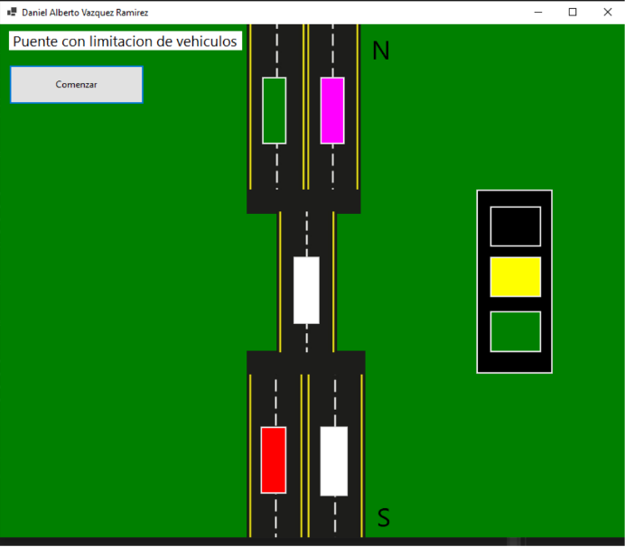

# Solucion-Problemas-Concurrencia
Estos programas simulan la aplicación de soluciones a problemas de concurrencia en memoria utilizando distintos algoritmos.

## Filósofos comensales

Cinco filósofos viven en una casa, donde hay una mesa preparada para ellos. Básicamente, la vida de cada
filósofo consiste en pensar y comer, y después de años de haber estado pensando, todos los filósofos están
de acuerdo en que la única comida que contribuye a su fuerza mental son los espaguetis. Debido a su falta
de habilidad manual, cada filósofo necesita dos tenedores para comer los espaguetis.

El problema: diseñar un ritual (algoritmo) que permita a los
filósofos comer. El algoritmo debe satisfacer la exclusión mutua (no puede haber dos filósofos que
puedan utilizar el mismo tenedor a la vez) evitando el interbloqueo y la inanición (en este caso, el término
tiene un sentido literal, además de algorítmico).

### Solución
El funcionamiento se basa en elegir un filósofo para comer y liberarlo en algún momento dado para que
otro pueda comer. Siempre se tiene que poder liberar para que los demás puedan comer y asignar bien las
variables correspondientes.

Propuesta
  <ul>
    <li>Lista enlazada circular</li>
    <li>Clase filósofo</li>
    <li>Método liberar tenedores</li>
    <li>Método obtener tenedores</li>
    <li>Timers</li>
    <li>Variables booleanas para el manejo de la disponibilidad de tenedores</li>
  </ul>

Fuente: Stallings, W. (2005). Sistemas Operativos (5ta ed.). Pearson.

## Semáforos

Semáforo: El principio fundamental es éste: dos o más procesos pueden cooperar por medio de simples
señales, tales que un proceso pueda ser obligado a parar en un lugar específico hasta que haya recibido
una señal específica. Cualquier requisito complejo de coordinación puede ser satisfecho con la estructura
de señales apropiada. Para la señalización, se utilizan unas variables especiales llamadas semáforos. Para
transmitir una señal vía el semáforo s, el proceso ejecutará la primitiva semSignal(s). Para recibir una 
señal vía el semáforo s, el proceso ejecutará la primitiva semWait(s); si la correspondiente señal no se ha
transmitido todavía, el proceso se suspenderá hasta que la transmisión tenga lugar.

## Solución

 Para conseguir el efecto deseado, el semáforo puede ser visto como una variable que contiene un valor entero sobre el cual sólo están definidas tres operaciones: 

Un semáforo puede ser inicializado a un valor no negativo. La operación semWait decrementa el valor del semáforo. Si el valor pasa a ser negativo, entonces el
proceso que está ejecutando semWait se bloquea. En otro caso, el proceso continúa su ejecución. La operación semSignal incrementa el valor del semáforo. Si el valor es menor o igual que cero, entonces
se desbloquea uno de los procesos bloqueados en la operación semWait. Aparte de estas tres operaciones no hay manera de inspeccionar o manipular un semáforo.

Fuentes:

Stallings, W. (2005). Sistemas Operativos (5ta ed.). Pearson.

Vega, H. (2023). Problemas de la concurrencia./Clases/2211-historia-programacion/35081-problemas-de-la-concurrencia/.
  https://platzi.com/clases/2211-historia-programacion/35081-problemas-de-la-concurrencia/

Tanenbaum, A. S. (2009). SISTEMAS OPERATIVOS MODERNOS (3a. ed.).PEARSON EDUCACIÓN,
México,

